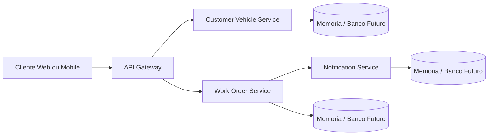

# Arquitetura da Solucao

## Visao geral

A solucao **Auto Center Marica OS** foi projetada com microsservicos e Arquitetura Limpa para evitar que regras importantes da oficina fiquem presas ao framework web, ao banco de dados ou ao provedor de hospedagem.

## Contexto do negocio

A oficina precisa controlar o ciclo completo de atendimento:

1. cliente solicita atendimento;
2. atendente cadastra cliente e veiculo;
3. mecanico abre diagnostico;
4. ordem de servico recebe prioridade;
5. cliente e notificado sobre andamento;
6. gestor acompanha status e historico.

## Microsservicos

### 1. API Gateway

Responsavel por centralizar a entrada das requisicoes externas. Ele atua como uma fachada para os demais servicos.

Responsabilidades:

- expor uma API unica para futuros frontends;
- consultar servicos internos;
- reduzir acoplamento entre cliente externo e microsservicos;
- concentrar configuracoes de URLs internas.

### 2. Customer Vehicle Service

Responsavel pelo cadastro de clientes e veiculos.

Principais regras:

- cliente precisa ter nome e telefone;
- veiculo precisa ter placa, modelo e ano;
- placa deve ser armazenada em maiusculo;
- um cliente pode possuir um veiculo no exemplo minimo.

### 3. Work Order Service

Responsavel por abrir e controlar ordens de servico.

Principais regras:

- toda ordem recebe um identificador unico;
- toda ordem inicia com status `opened`;
- prioridade e calculada por estrategia;
- reclamacoes urgentes devem ter maior prioridade.

### 4. Notification Service

Responsavel por registrar notificacoes enviadas ao cliente.

Neste projeto academico, o envio e simulado em memoria. Em producao, a mesma interface poderia ser implementada por WhatsApp, SMS ou e-mail.

## Arquitetura Limpa

Cada microsservico segue a divisao:

```text
domain
application
infrastructure
interfaces
```

### Camada Domain

Contem entidades, value objects, contratos e regras que nao dependem de FastAPI, banco de dados, Docker ou qualquer framework.

Exemplo:

- `Customer`
- `Vehicle`
- `WorkOrder`
- `PriorityStrategy`
- `CustomerRepository`

### Camada Application

Contem casos de uso. Um caso de uso representa uma acao do sistema, como cadastrar cliente ou abrir ordem de servico.

Exemplos:

- `RegisterCustomerWithVehicle`
- `CreateWorkOrder`
- `SendNotification`

### Camada Infrastructure

Contem implementacoes concretas de contratos definidos no dominio.

Exemplo:

- `InMemoryCustomerRepository`
- `InMemoryWorkOrderRepository`
- `InMemoryNotificationRepository`

Em uma versao produtiva, essa camada poderia ser substituida por PostgreSQL, MongoDB ou outro armazenamento.

### Camada Interfaces

Contem pontos de entrada, como APIs HTTP, DTOs e controllers.

Exemplo:

- `api.py`
- modelos Pydantic
- rotas FastAPI

## Fluxo de dependencias

As dependencias apontam para dentro:

```text
interfaces -> application -> domain
infrastructure -> domain
```

A camada de dominio nao conhece FastAPI nem implementacoes de infraestrutura. Isso atende ao principio da inversao de dependencia e reduz acoplamento.

## Diagrama de alto nivel



## Decisoes arquiteturais

### Por que microsservicos?

A oficina possui dominios bem separados: cadastro, ordem de servico e comunicacao. Separar esses dominios permite evoluir cada parte sem alterar todo o sistema.

### Por que API Gateway?

O Gateway evita que consumidores externos precisem conhecer todos os microsservicos. Isso simplifica um futuro frontend e reduz acoplamento.

### Por que repositorios em memoria?

Para a prova, o foco esta na arquitetura e nos conceitos. O repositorio em memoria torna a execucao simples. Como existe uma interface de repositorio, a troca por banco real e direta.

### Por que FastAPI?

FastAPI e leve, moderno, simples de documentar e gera Swagger automaticamente. Isso facilita a demonstracao da solucao.

